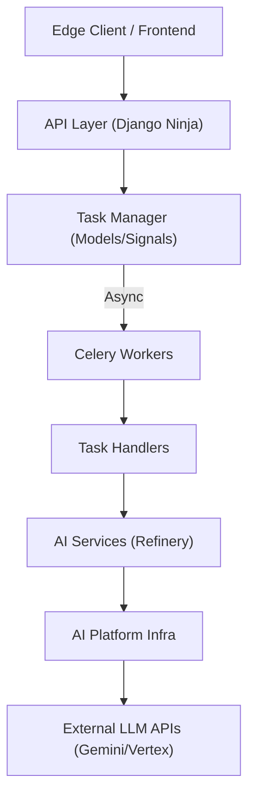

# VisifyStoryStudio (VSS Cloud) 架构设计文档

> **版本**: v1.0
> **生成日期**: 2026-01-09

## 1. 系统概览

**VisifyStoryStudio (VSS Cloud)** 是一个云原生视频 AI 工作流后台服务。它旨在通过统一的任务管理系统，接收并执行各种原子化的 AI 任务（如字幕处理、角色识别、视觉分析、解说生成等），为上层应用提供强大的视频理解与生成能力。

系统采用 **Django + Celery** 的异步架构，结合 **Google Gemini / Vertex AI** 等大模型能力，支持多租户（Organization/Edge）隔离。

---

## 2. 系统分层架构

系统整体遵循 **分层架构 (Layered Architecture)**，各层职责清晰，依赖单向流动。



### 2.1 接口层 (API Layer)
*   **技术栈**: Django Ninja
*   **职责**: 处理 HTTP 请求，进行鉴权 (EdgeAuth)，参数校验，并创建 `Task` 记录。
*   **关键文件**: `task_manager/api.py`, `file_service/api.py`

### 2.2 任务调度层 (Task Orchestration)
*   **核心实体**: `Task` 模型 (支持 FSM 状态机)。
*   **机制**:
    1.  **创建**: API 创建 Task 记录 (状态 `PENDING`)。
    2.  **分发**: `post_save` 信号触发 `transaction.on_commit`，将任务 ID 发送至 Celery 消息队列。
    3.  **路由**: 根据 `TaskType` 将任务路由至不同的物理队列 (e.g., `queue_gemini`, `queue_io`)。
*   **关键文件**: `task_manager/models.py`, `task_manager/signals.py`

### 2.3 执行处理层 (Handlers)
*   **定位**: 连接“调度系统”与“业务服务”的胶水层。
*   **职责**:
    *   加载配置 (`AIConfigLoader`)。
    *   初始化基础设施 (Logger, `GeminiProcessor`, `VertexProcessor`)。
    *   处理租户隔离 (计算输出路径)。
    *   调用 Service 层执行核心逻辑。
    *   结果落盘与错误处理。
*   **原则**: Handler 不包含 AI 业务逻辑，只负责“组装”。
*   **关键路径**: `task_manager/handlers/refinery/`

### 2.4 业务服务层 (AI Services - Refinery)
*   **定位**: 核心业务逻辑单元，纯粹的 Python 类。
*   **职责**:
    *   接收清洗后的数据和配置。
    *   预处理数据 (Preprocessing)。
    *   渲染提示词 (Prompt Engineering via Jinja2)。
    *   与 LLM 交互 (Inference)。
    *   后处理与结构化 (Post-processing)。
*   **关键路径**: `ai_services/refinery/`

### 2.5 基础设施层 (AI Platform Infra)
*   **定位**: 底层工具库，屏蔽模型差异。
*   **组件**:
    *   `GeminiProcessor`: 封装 Google AI Studio API，处理重试、日志、Schema 校验。
    *   `VertexProcessor`: 封装 Vertex AI API，支持 ADC 鉴权和 GCS 多模态输入。
    *   `CostCalculator`: 统一计费逻辑。
*   **关键路径**: `ai_services/ai_platform/llm/`

---

## 3. Refinery 开发范式 (The New Standard)

为了应对日益复杂的 AI 业务，项目确立了名为 **"Refinery"** 的开发范式，核心原则如下：

### 3.1 配置驱动 (Configuration-Driven)
*   **原则**: 所有技术参数（Model, Temperature, Batch Size）由服务端统一配置管理，而非硬编码或由客户端随意指定。
*   **实现**: `ai_services/configs/ai_inference_config.yaml` + `AIConfigLoader`。

### 3.2 双模式运行 (Dual-Mode)
*   **PROD 模式**: 严格使用配置文件参数，忽略客户端传入的技术参数，保证生产稳定性。
*   **DEBUG 模式**: 允许客户端通过 `service_params` 覆盖技术参数，并输出全量 Prompt/Response 日志，方便调试。

### 3.3 关注点分离与契约隔离
*   **公共契约 (Public Schemas)**: 定义在 `ai_services/schemas/refinery/`。这是服务对外的 API 接口，包含 `Payload` 和 `Response`。
*   **私有模型 (Private Schemas)**: 定义在 `ai_services/refinery/<service>/schemas.py`。这是服务内部与 LLM 交互的结构 (Instruction)，不对外暴露。

### 3.4 表现与逻辑分离 (Jinja2)
*   **原则**: 禁止在 Python 代码中拼接 Prompt 字符串。
*   **实现**: 使用 `Jinja2` 模板引擎 (`.j2` 文件) 管理提示词。Python 代码只负责准备结构化数据 (List/Dict) 传入模板。
*   **优势**: 支持复杂的逻辑控制 (If/For)、多语言适配 (`_zh.j2`, `_en.j2`) 和动态上下文注入。

### 3.5 BFF 友好型输出
*   **原则**: 对于枚举类型的数据 (如 `ShotType`, `SceneType`)，输出结构化对象 `{ "value": "enum_val", "label": "本地化标签" }`，既满足后端逻辑判断，又方便前端直接展示。

---

## 4. 核心服务模块

### 4.1 Subtitle Merger (字幕合并)
*   **功能**: 将碎片化的 ASR 字幕合并为语义完整的句子。
*   **特点**: 采用 **Instruction-Based** 模式，LLM 只返回合并指令 (Indices)，本地代码重构文本，确保时间戳零误差。

### 4.2 Character Identifier (角色识别)
*   **功能**: 识别字幕中的说话人，并进行归一化。
*   **特点**:
    *   **双阶段推理**: Batch Inference (批量识别) -> Recursive Refinement (递归精修/归一化)。
    *   **多模态辅助**: 利用声纹性别特征辅助推理。
    *   **防幻觉**: 归一化阶段注入 VIP 角色名单作为强约束。

### 4.3 Visual Analyzer (视觉分析)
*   **功能**: 提取视频帧的景别、环境、主体、动作等元数据。
*   **特点**:
    *   **多模态**: 使用 `VertexProcessor` 直接读取 GCS 图片。
    *   **高并发**: 使用 `ThreadPoolExecutor` 并发处理。
    *   **断点续传**: 支持结果缓存。

### 4.4 Slice Regrouper (场景聚类)
*   **功能**: 基于多模态信息（视觉+文本）将切片聚类为场景。
*   **特点**:
    *   **上下文感知**: LLM 阅读包含视觉描述和对白的完整日志。
    *   **去重优化**: Service 层预先对视觉帧进行去重，节省 Token。

---

## 5. 目录结构说明

```text
VisifyStoryStudio/
├── ai_services/                # [核心] AI 业务逻辑
│   ├── ai_platform/            # 基础设施 (LLM Processors)
│   ├── configs/                # 配置文件 (yaml)
│   ├── refinery/               # 原子服务实现 (Service, Prompts, Private Schemas)
│   │   ├── character_identifier/
│   │   ├── slice_regrouper/
│   │   ├── subtitle_merger/
│   │   └── visual_analyzer/
│   ├── schemas/                # 公共数据契约 (Public Schemas)
│   │   └── refinery/
│   └── utils/                  # 工具类 (ConfigLoader, PromptManager)
├── task_manager/               # [核心] 任务调度
│   ├── handlers/               # 执行层 (Handlers)
│   ├── models.py               # 任务模型与状态机
│   ├── api.py                  # API 接口
│   └── signals.py              # 异步路由配置
├── file_service/               # 文件服务 (上传/下载/GCS)
├── organization/               # 租户管理
└── doc/                        # 项目文档
```

---

## 6. 扩展指南

添加新任务时，请遵循 `doc/task_manager/add_new_task_guide.md` 和 `doc/guidance/refinery_service_development_guide.md`。

简要流程：
1.  **Model**: 在 `Task.TaskType` 添加枚举。
2.  **Schema**: 定义 Public Schema (`ai_services/schemas/refinery/`).
3.  **Service**: 实现业务逻辑 (`ai_services/refinery/`)，编写 Jinja2 模板。
4.  **Config**: 在 `ai_inference_config.yaml` 添加配置。
5.  **Handler**: 编写 Handler 并注册 (`@HandlerRegistry.register`).
6.  **Signal**: 配置队列路由。
7.  **API**: 配置输出路径前缀。