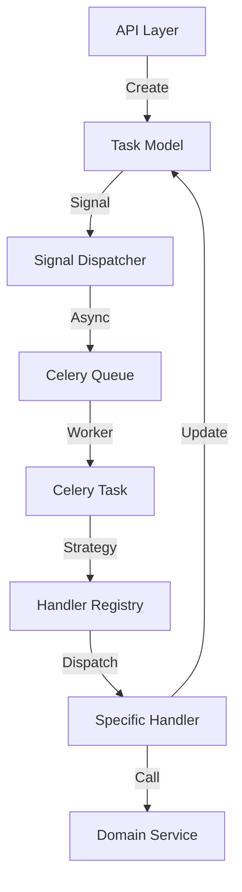

# Task Manager 架构深度分析

> **版本**: v1.1
> **生成日期**: 2026-02-24

## 1. 模块定位
`task_manager` 是 VSS Cloud 的核心调度中枢，负责所有异步任务的生命周期管理。它连接了上层 API 接口与底层具体的 AI 业务逻辑，实现了请求接收、任务持久化、异步分发、执行路由、状态流转以及结果落盘的完整闭环。

## 2. 核心架构图

## 3. 关键组件分析

### 3.1 数据模型层 (Models)
*   **核心实体**: `Task`
*   **状态机 (FSM)**: 使用 `django-fsm` 管理状态流转 (`PENDING` -> `RUNNING` -> `COMPLETED`/`FAILED`)。
    *   `start()`: 标记开始，记录 `started_at`。
    *   `complete()`: 标记完成，记录结果和 `finished_at`。
    *   `fail()`: 标记失败，记录错误信息。
*   **多租户隔离**: 通过 `organization` 和 `assigned_edge` 字段实现资源归属划分。
*   **类型定义**: `TaskType` 枚举定义了系统支持的所有原子能力。
*   **错误处理**: 新增 `error` 字段 (JSONField)，用于存储结构化的错误信息 (code, message, details)。

### 3.2 接口层 (API)
*   **技术栈**: Django Ninja
*   **职责**:
    *   **鉴权**: 验证 Edge 端的身份。
    *   **路径预处理**: 将相对路径自动补全为绝对路径 (`absolute_..._path`)，简化下游处理。
    *   **输出预留**: 根据任务类型预生成输出文件路径，确保幂等性和可追踪性。
*   **设计亮点**: 接口层不包含业务逻辑，仅做参数标准化和任务创建。

### 3.3 调度与分发层 (Signals & Queues)
*   **触发机制**: 利用 Django `post_save` 信号监听 `Task` 创建。
*   **事务安全**: 使用 `transaction.on_commit` 确保数据库事务提交后再发送 Celery 消息，防止 Worker 读不到数据。
*   **智能路由 (`QUEUE_ROUTING`)**:
    *   基于 `definitions.py` 中的 `TASK_CONFIGS` 自动生成路由表。
    *   根据 `TaskType` 将任务分发到不同的物理队列（如 `queue_gemini` 用于限流的 AI 任务，`queue_io` 用于高并发 IO 任务）。
    *   实现了不同类型任务的资源隔离和流控。

### 3.4 执行层 (Celery Tasks)
*   **入口**: `execute_cloud_native_task`
*   **并发控制**: 使用 `select_for_update()` 锁定任务行，防止分布式环境下的竞态条件。
*   **幂等性**: 执行前检查任务状态，避免重复执行。
*   **错误处理**: 捕获异常并自动更新任务状态为 `FAILED`，并将错误信息写入 `error` 字段。
*   **限流重试**: 针对 `RateLimitException` 实现指数退避重试。

### 3.5 策略层 (Handlers)
*   **设计模式**: 策略模式 (Strategy Pattern)
*   **组件**:
    *   `BaseTaskHandler`: 定义标准接口 `handle(task)`。
    *   `HandlerRegistry`: 维护 `TaskType` 到 `Handler` 类的映射。
    *   `@HandlerRegistry.register`: 装饰器实现自动注册，符合开闭原则 (OCP)。
*   **职责**:
    *   **胶水层**: 连接 Task Manager 和 AI Services。
    *   **配置加载**: 读取 `ai_inference_config.yaml`。
    *   **基础设施初始化**: 准备 Logger, GeminiProcessor 等。
    *   **结果落盘**: 将 Service 返回的内存对象序列化为 JSON 文件。

## 4. 数据流转全景

1.  **提交**: Edge 端 POST `/api/v1/tasks/`，携带 Payload。
2.  **创建**: API 创建 `Task` 记录 (PENDING)，计算好输入输出绝对路径。
3.  **入队**: 事务提交后，Signal 根据 `QUEUE_ROUTING` 将任务 ID 发送至 Redis/RabbitMQ。
4.  **调度**: Celery Worker 从指定队列领取任务。
5.  **锁定**: Worker 开启数据库事务，锁定该 Task 记录，状态变更为 RUNNING。
6.  **分发**: `execute_cloud_native_task` 通过 `HandlerRegistry` 找到对应的 Handler (e.g., `RefinerySubtitleMergerHandler`)。
7.  **执行**: Handler 初始化 Service，调用 `service.execute()`。
8.  **完成**: Service 返回结果，Handler 将结果写入文件系统。
9.  **结算**: Worker 更新 Task 状态为 COMPLETED，写入 `result` 摘要，释放锁。

## 5. 架构优势

1.  **高扩展性**: 新增任务只需增加 Enum、编写 Handler 并注册，无需修改调度核心代码。
2.  **高可靠性**: 事务感知、行级锁、自动重试机制保证了任务不丢失、不冲突。
3.  **资源隔离**: 通过队列路由，避免了 IO 密集型任务阻塞 AI 计算型任务。
4.  **关注点分离**: 调度逻辑与业务逻辑物理分离，Handler 作为防腐层，使得底层 AI Service 可以独立演进（如 Refinery 架构）。

## 6. 演进方向 (Refinery)

目前的 `task_manager` 完美支持了新的 **Refinery** 开发范式：
*   **配置驱动**: Handler 负责加载配置注入 Service。
*   **双模式**: Handler 解析 Payload 中的 `mode` 和 `service_params`。
*   **Schema 校验**: Handler 层使用 Pydantic 进行严格的输入输出校验。

---

## 附录：关键代码映射

| 模块 | 关键文件 | 职责 |
| :--- | :--- | :--- |
| **Definitions** | `task_manager/definitions.py` | 任务类型枚举, 队列配置, 输出前缀配置 |
| **Models** | `task_manager/models.py` | 数据库定义, FSM 状态机 |
| **API** | `task_manager/api.py` | HTTP 接口, 路径预处理 |
| **Schemas** | `task_manager/schemas.py` | API 输入输出校验 |
| **Signals** | `task_manager/signals.py` | 异步触发, 队列路由配置 |
| **Tasks** | `task_manager/tasks.py` | Celery 任务入口, 锁机制, 重试 |
| **Registry** | `task_manager/handlers/registry.py` | Handler 注册与查找 |
| **BaseHandler** | `task_manager/handlers/base.py` | Handler 抽象基类 |
| **Admin** | `task_manager/admin.py` | 后台管理, 数据可视化 |
| **Dashboard** | `task_manager/dashboard.py` | 统计报表逻辑 |